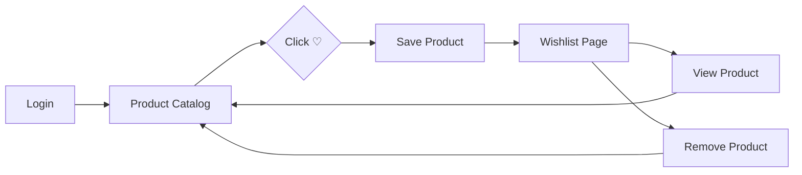
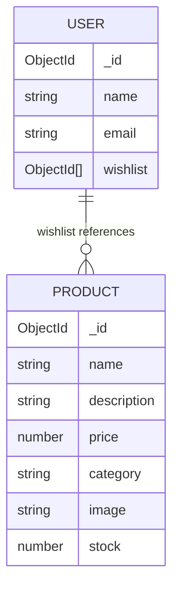
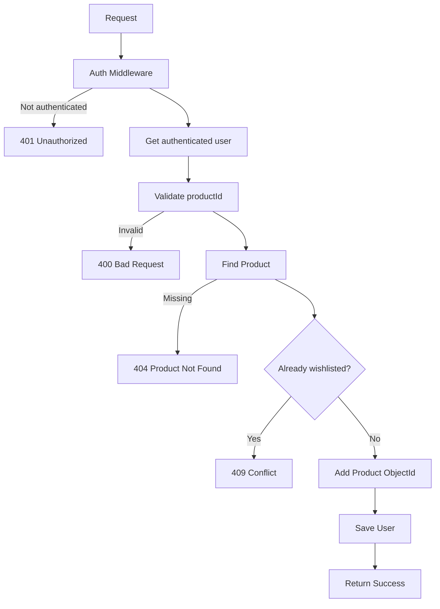
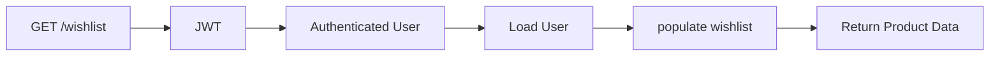
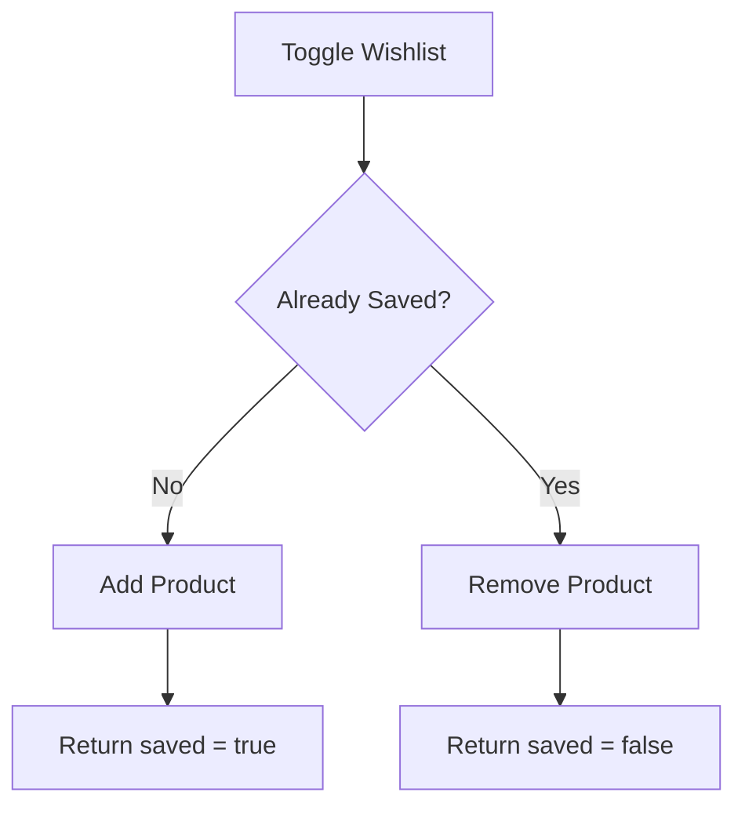

# 🛍️ Engineering Lab 04 — ShopKart Wishlist

> **Build a production-style Wishlist experience for ShopKart.**
>
> You are not just implementing APIs. You are building a complete feature: user journey, UI states, backend behaviour, database relationship, edge cases and acceptance criteria.

---

## 📋 Lab Overview

| | |
|---|---|
| **Application** | ShopKart |
| **Lab** | 04 |
| **Duration** | 2 Hours |
| **Mode** | Individual |
| **Total Marks** | **100** |
| **Primary Theme** | MongoDB Relationships + Protected APIs |
| **Frontend** | React |
| **Backend** | Node.js + Express |
| **Database** | MongoDB |
| **Authentication** | JWT from Lab-02 |
| **State Management** | **Not required** |

> **Important:** This lab is intentionally placed **before Context API / Redux**.
>
> The wishlist is a **persistent backend feature**, not a global frontend-state exercise. Do not solve the core requirement using Redux, Context API or another global state-management library.

---

# 1. 🎯 Product Brief

## The Problem

A ShopKart customer is browsing products and finds something they like.

But they are not ready to purchase it yet.

They need a simple way to:

1. Save the product.
2. Come back later.
3. See everything they saved.
4. Remove products they no longer want.

### Desired experience

```text
Browse Products
       ↓
Click ♡
       ↓
Product is saved
       ↓
Open Wishlist
       ↓
See saved products
       ↓
View / Remove / Continue Shopping
```

---

# 2. 🧑‍💻 What Are You Building?

You are extending the ShopKart application built in Labs 01–03.



### Feature scope

- Add a product to wishlist
- Prevent duplicates
- View current user's wishlist
- Remove a product
- Persist wishlist in MongoDB
- Protect wishlist APIs
- Populate Product data
- Handle loading / empty / error states
- Add Wishlist navigation
- Keep the UI responsive to API state

---

# 3. 🧠 Learning Objectives

By the end of the lab, you should understand:

### Database

- MongoDB relationships
- ObjectId references
- Mongoose `ref`
- Mongoose `populate()`

### Backend

- Protected REST APIs
- Authentication middleware
- User-specific resources
- Validation
- Duplicate prevention
- HTTP status codes

### Frontend

- API-driven UI
- Dynamic React rendering
- React Router
- Request lifecycle states
- Feature-level error handling

---

# 4. 🗺️ User Journey

## Step 1 — Discover a Product

The user opens:

```text
/products
```

A product card should expose a Wishlist action.

### Product card

```text
┌──────────────────────────────────┐
│                         ♡        │
│          PRODUCT IMAGE           │
│                                  │
├──────────────────────────────────┤
│ Noise Cancelling Headphones      │
│ Electronics                      │
│ ₹4,999                           │
│ 12 units left                    │
│                                  │
│ [ View Details ] [ ♡ Wishlist ] │
└──────────────────────────────────┘
```

When the user clicks **♡ Add to Wishlist**, the frontend calls:

```http
POST /wishlist/:productId
```

---

# 5. ✨ Wishlist Interaction States

A good feature clearly communicates what is happening.

### Default

```text
♡ Add to Wishlist
```

### Request in progress

```text
⏳ Saving...
```

The action should not trigger duplicate requests.

### Success

```text
♥ Added to Wishlist
```

### Failure

```text
Unable to save product.
Please try again.
```

Do not silently fail.

---

# 6. ❤️ Wishlist Page

Create:

```text
/wishlist
```

### Suggested layout

```text
┌─────────────────────────────────────────────────────────────┐
│ ShopKart                         Products   Wishlist   Logout│
├─────────────────────────────────────────────────────────────┤
│                                                             │
│  My Wishlist                                               │
│  4 products saved                                          │
│                                                             │
│  ┌─────────────┐  ┌─────────────┐  ┌─────────────┐        │
│  │    IMAGE    │  │    IMAGE    │  │    IMAGE    │        │
│  │             │  │             │  │             │        │
│  ├─────────────┤  ├─────────────┤  ├─────────────┤        │
│  │ Product A   │  │ Product B   │  │ Product C   │        │
│  │ ₹2,499      │  │ ₹4,999      │  │ ₹1,299      │        │
│  │ Electronics │  │ Fashion     │  │ Books       │        │
│  │             │  │             │  │             │        │
│  │ [View]      │  │ [View]      │  │ [View]      │        │
│  │ [Remove]    │  │ [Remove]    │  │ [Remove]    │        │
│  └─────────────┘  └─────────────┘  └─────────────┘        │
│                                                             │
└─────────────────────────────────────────────────────────────┘
```

---

# 7. 📱 Wishlist Card Specification

Every saved product should display:

| Field | Required |
|---|:---:|
| Product image | ✅ |
| Product name | ✅ |
| Price | ✅ |
| Category | ✅ |
| Stock status | ✅ |
| View Details | ✅ |
| Remove from Wishlist | ✅ |

Example:

```text
┌───────────────────────────────┐
│          PRODUCT IMAGE        │
├───────────────────────────────┤
│ Mechanical Keyboard           │
│ Electronics                   │
│ ₹2,999                        │
│ 10 units left                 │
│                               │
│ [ View Details ]              │
│ [ Remove ♥ ]                  │
└───────────────────────────────┘
```

---

# 8. 🧭 Navigation

Update the Navbar created in previous labs.

### Expected

```text
Home | Products | Wishlist | Logout
```

The user should be able to:

```text
Products → Wishlist
Wishlist → Product Details
Wishlist → Products
```

Use **React Router** for navigation.

---

# 9. 💤 Empty Wishlist State

An empty wishlist is a valid state.

Do not render a blank page.

### Expected empty state

```text
                 ❤️

          Your wishlist is empty

      Save products you love and
          find them here later.

          [ Browse Products ]
```

Clicking **Browse Products** should navigate to:

```text
/products
```

---

# 10. ⏳ Loading State

While the wishlist API is running, show an intentional loading state.

Example:

```text
Loading your wishlist...
```

You may use text, a spinner, skeleton cards or another clear loading treatment.

A blank screen is **not** an acceptable loading experience.

---

# 11. ❌ Error State

If loading the wishlist fails:

```text
Something went wrong.

We couldn't load your wishlist.

[ Try Again ]
```

The Retry action should make another API request.

---

# 12. 🗃️ Data Model

The key engineering problem in this lab is the relationship between:

```text
User
  │
  │ owns
  ▼
Wishlist
  │
  │ references
  ▼
Products
```

### Relationship diagram



### Important design rule

The wishlist should contain **Product references**, not duplicated Product objects.

---

# 13. ❌ What NOT To Store

Do **not** store:

```js
wishlist: [
  {
    name: "Mechanical Keyboard",
    price: 2999,
    image: "...",
    category: "Electronics"
  }
]
```

Instead store:

```js
wishlist: [
  ObjectId("...")
]
```

### Why?

Because the Product collection remains the **source of truth**.

Product price, stock, image or other information can change without requiring duplicated wishlist data to be updated.

---

# 14. 🧩 Task Breakdown

## Task 1 — Extend User Schema
### **15 Marks**

Add a `wishlist` field to the existing User model.

### Required shape

```js
wishlist: [
  {
    type: mongoose.Schema.Types.ObjectId,
    ref: "Product"
  }
]
```

### Requirements

- Use `Schema.Types.ObjectId`
- Reference `Product`
- Default to `[]`
- Existing users should continue to work

---

## Task 2 — Add Product to Wishlist API
### **15 Marks**

### Endpoint

```http
POST /wishlist/:productId
```

### Authentication

Use the authentication middleware from Lab-02.

The server should identify the user from the authenticated request.

> **Do not accept `userId` from the request body.**

### Backend flow



### Request

```http
POST /wishlist/66d123abc456...
Authorization: Bearer <token>
```

### Success response

```json
{
  "success": true,
  "message": "Product added to wishlist"
}
```

### Failure cases

| Scenario | Status |
|---|---:|
| Not authenticated | 401 |
| Invalid product ID | 400 |
| Product not found | 404 |
| Already in wishlist | 409 |

---

## Task 3 — Get Current User's Wishlist
### **20 Marks**

### Endpoint

```http
GET /wishlist
```

### The API must

1. Authenticate the user.
2. Identify the current user from authentication middleware.
3. Find that user's document.
4. Populate wishlist references.
5. Return the products.

### Important security rule

Do **not** create:

```http
GET /wishlist/:userId
```

The client should never choose which user's wishlist it can access.

### Correct flow



### Example response

```json
{
  "success": true,
  "count": 2,
  "wishlist": [
    {
      "_id": "66d123",
      "name": "Mechanical Keyboard",
      "price": 2999,
      "category": "Electronics",
      "image": "https://example.com/keyboard.jpg",
      "stock": 10
    },
    {
      "_id": "66d456",
      "name": "Wireless Headphones",
      "price": 4999,
      "category": "Electronics",
      "image": "https://example.com/headphones.jpg",
      "stock": 5
    }
  ]
}
```

### `populate()`

A possible approach:

```js
User.findById(userId).populate({
  path: "wishlist",
  select: "name price category image stock"
});
```

You may implement the query differently as long as the same behaviour is achieved.

---

## Task 4 — Remove Product from Wishlist
### **10 Marks**

### Endpoint

```http
DELETE /wishlist/:productId
```

### Backend flow

```text
Request
   ↓
Authenticate
   ↓
Find Current User
   ↓
Check Wishlist
   ↓
Remove Product Reference
   ↓
Save User
   ↓
Return Success
```

### Success response

```json
{
  "success": true,
  "message": "Product removed from wishlist"
}
```

### Failure cases

| Scenario | Status |
|---|---:|
| Not authenticated | 401 |
| Invalid product ID | 400 |
| Product not in wishlist | 404 |

---

# 15. 🔌 API Contract

| Method | Endpoint | Auth | Purpose |
|---|---|:---:|---|
| POST | `/wishlist/:productId` | ✅ | Add product |
| GET | `/wishlist` | ✅ | Get current user's wishlist |
| DELETE | `/wishlist/:productId` | ✅ | Remove product |

---

# 16. 🖥️ Frontend Requirements

## Task 5 — Product Card Integration
### **10 Marks**

Update the Product Card from Lab-03.

### Default

```text
♡ Add to Wishlist
```

### While request is running

```text
⏳ Saving...
```

### After success

```text
♥ Added to Wishlist
```

### On failure

Show a useful error message.

### Requirements

- No page refresh
- Use the authenticated session/token
- Prevent duplicate clicks while saving
- Handle API failure

---

## Task 6 — Wishlist Page
### **15 Marks**

Create:

```text
/wishlist
```

Fetch:

```http
GET /wishlist
```

### Required actions

Every wishlist card should provide:

```text
[ View Details ]

[ Remove from Wishlist ]
```

Render all products dynamically.

> **Do not hardcode wishlist products in React.**

---

## Task 7 — Loading, Empty and Error States
### **5 Marks**

Implement all three states.

### Loading

```text
Loading your wishlist...
```

### Empty

```text
Your wishlist is empty ❤️
Start saving products you love.

[ Browse Products ]
```

### Error

```text
Unable to load wishlist.

[ Try Again ]
```

---

## Task 8 — Navbar + Routing
### **5 Marks**

Add:

```text
Wishlist
```

to the existing Navbar.

Add:

```text
/wishlist
```

as a React Router route.

---

# 17. 🧪 Postman Test Plan

Before connecting React, prove that the backend works.

### Test 1 — Add

```http
POST /wishlist/:productId
```

**Expected:** 200/201 Success

### Test 2 — Duplicate

Call the same endpoint again.

**Expected:** 409 Conflict

### Test 3 — Get

```http
GET /wishlist
```

**Expected:** Only the authenticated user's wishlist

### Test 4 — Remove

```http
DELETE /wishlist/:productId
```

**Expected:** Success

### Test 5 — Unauthenticated

Call any protected wishlist endpoint without a valid token.

**Expected:** 401 Unauthorized

---

# 18. 🧱 Suggested Project Structure

## Backend

```text
backend/
│
├── controllers/
│   ├── auth.controller.js
│   ├── product.controller.js
│   └── wishlist.controller.js
│
├── models/
│   ├── user.model.js
│   └── product.model.js
│
├── routes/
│   ├── auth.routes.js
│   ├── product.routes.js
│   └── wishlist.routes.js
│
├── middlewares/
│   └── auth.middleware.js
│
└── index.js
```

## Frontend

```text
src/
│
├── pages/
│   ├── Products.jsx
│   ├── ProductDetails.jsx
│   └── Wishlist.jsx
│
├── components/
│   ├── Navbar.jsx
│   ├── ProductCard.jsx
│   └── WishlistCard.jsx
│
├── services/
│   └── api.js
│
├── App.jsx
└── main.jsx
```

> You may organise files differently, but responsibilities should remain clearly separated.

---

# 19. 🚨 Edge Cases

A production-style feature must handle more than the happy path.

| Scenario | Expected Behaviour |
|---|---|
| Product does not exist | 404 |
| Invalid product ID | 400 |
| User is not logged in | 401 |
| Product already saved | 409 |
| Product not in wishlist during removal | 404 |
| Wishlist has zero items | Empty state |
| Wishlist request fails | Error state |
| User refreshes page | Wishlist remains |
| User logs in again | Wishlist remains |
| User requests another user's wishlist | Access denied |

---

# 20. ✅ Product Acceptance Criteria

## Backend

- [ ] User model contains `wishlist`
- [ ] Wishlist stores Product ObjectIds
- [ ] Product reference uses `ref: "Product"`
- [ ] Add API works
- [ ] Duplicate products are prevented
- [ ] Get Wishlist API works
- [ ] `populate()` is used
- [ ] Remove API works
- [ ] All wishlist endpoints are protected
- [ ] User identity comes from authentication middleware

## Frontend

- [ ] Product cards contain Wishlist action
- [ ] Wishlist page exists
- [ ] Wishlist data comes from API
- [ ] Wishlist cards are dynamic
- [ ] View Details works
- [ ] Remove works
- [ ] Navbar contains Wishlist
- [ ] Loading state exists
- [ ] Empty state exists
- [ ] Error state exists
- [ ] No full-page refresh required

---

# 21. 📊 Evaluation Rubric

| Area | Marks |
|---|---:|
| User Schema + MongoDB Relationship | 15 |
| Add Wishlist API | 15 |
| Get Wishlist API + populate | 20 |
| Remove Wishlist API | 10 |
| Product Card Integration | 10 |
| Wishlist Page | 15 |
| Loading / Empty / Error States | 5 |
| Code Quality / Structure | 5 |
| Viva | 5 |
| **Total** | **100** |

---

# 22. 🎤 TA Viva Questions

Ask any 3–5 based on the student's implementation.

### Database

1. Why are we storing ObjectIds instead of Product objects?
2. What does `ref: "Product"` do?
3. What is the difference between embedding and referencing?
4. Why do we use `populate()`?

### Backend

5. Why should wishlist endpoints be protected?
6. Why should the server get the user ID from the JWT?
7. Why should we not accept `userId` from the client?
8. How are duplicate wishlist entries prevented?
9. What HTTP status should be returned for a duplicate wishlist request?

### Frontend

10. Why should the Wishlist page fetch from the backend?
11. Why do we need loading, error and empty states?
12. Why should the wishlist survive a page refresh?

---

# 23. ⭐ Bonus — Wishlist Toggle
### **+10 Marks**

Implement a single toggle action.

### UI

Not saved:

```text
♡ Add to Wishlist
```

Saved:

```text
♥ Remove from Wishlist
```

### Optional endpoint

```http
PATCH /wishlist/:productId/toggle
```

### Behaviour



---

# 24. ⭐ Bonus — Wishlist Count
### **+5 Marks**

Display the number of saved products in the Navbar.

Example:

```text
Wishlist (3)
```

The value must come from the backend.

Do not hardcode it.

---

# 25. 🚫 Common Mistakes

### ❌ Sending `userId` from frontend

```json
{
  "userId": "123"
}
```

The server already knows the user through authentication.

### ❌ Storing entire products

```js
wishlist: [
  {
    name: "...",
    price: 2999
  }
]
```

Use references.

### ❌ Hardcoding wishlist data

```js
const wishlist = [...]
```

Wishlist data must come from the backend.

### ❌ Allowing duplicate entries

One product should appear only once for a user.

### ❌ Ignoring loading / error states

The UI should always communicate what is happening.

---

# 26. 📦 Submission Requirements

Submit the updated **ShopKart project** with:

- Backend wishlist APIs
- Updated User model
- React Wishlist page
- Product-card wishlist action
- Navbar integration
- Postman-tested APIs
- Error handling

AI tools may be used for assistance, but the student must be able to explain:

- The User → Product relationship
- The API flow
- Authentication
- `populate()`
- Duplicate prevention
- Frontend behaviour

---

# 27. 🚀 What Comes Next?

The ShopKart journey is now:

```text
┌─────────────────┐
│ Authentication  │
└────────┬────────┘
         ↓
┌─────────────────┐
│ Product Catalog │
└────────┬────────┘
         ↓
┌─────────────────┐
│ Wishlist ❤️     │
└────────┬────────┘
         ↓
┌─────────────────┐
│ Shopping Cart 🛒│
└────────┬────────┘
         ↓
┌─────────────────┐
│ Checkout 💳     │
└────────┬────────┘
         ↓
┌─────────────────┐
│ Orders 📦       │
└─────────────────┘
```

### Next Lab

The next lab will introduce **client-side state management** through the Shopping Cart.

That is where you will start asking:

> **What belongs in the backend, and what belongs in frontend state?**

---

<div align="center">

## ❤️ Build the feature like a product, not just an assignment.

**Happy Building — ShopKart Team**

</div>
