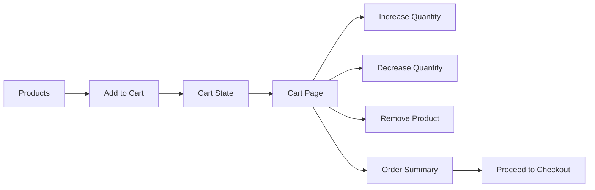
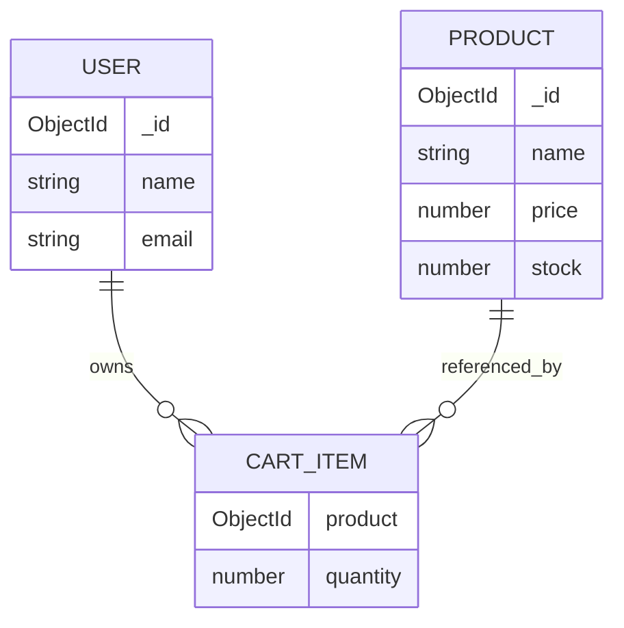
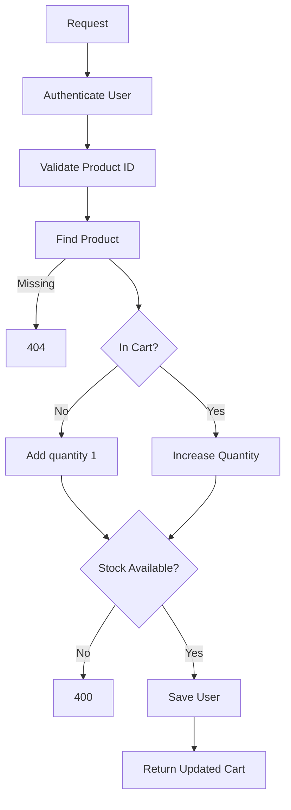

# 🛒 Engineering Lab 05 — ShopKart Shopping Cart

> **Build a complete Shopping Cart experience for ShopKart using frontend state management and persistent backend data.**
>
> This lab extends the Wishlist system from Lab-04 and introduces the core engineering problem of keeping **UI state, cart calculations and server data in sync**.

---

## 📋 Lab Overview

| | |
|---|---|
| **Application** | ShopKart |
| **Lab** | 05 |
| **Duration** | 2–2.5 Hours |
| **Mode** | Individual |
| **Total Marks** | **100** |
| **Primary Theme** | Cart State + Derived Data + Persistent APIs |
| **Frontend** | React |
| **Backend** | Node.js + Express |
| **Database** | MongoDB |
| **Authentication** | JWT |
| **State Management** | Context API or Redux Toolkit |

---

# 1. 🎯 Product Brief

## The Problem

A customer has decided that they may actually purchase a product.

A wishlist only answers:

> “What do I want to save for later?”

A cart must answer much more:

- What am I buying right now?
- How many units do I want?
- Is the requested quantity still available?
- What is my subtotal?
- What happens if I refresh the page?
- What happens if the same product is added again?
- What happens if product price or stock changes?

### Desired experience

```text
Browse Products
       ↓
Add to Cart
       ↓
Cart state updates instantly
       ↓
Open Cart
       ↓
Change Quantity / Remove Items
       ↓
See Order Summary
       ↓
Proceed to Checkout
```

---

# 2. 🧑‍💻 What Are You Building?

You are extending the ShopKart application from Labs 01–04.



### Feature scope

- Add products to cart
- Prevent duplicate cart rows
- Increase / decrease quantity
- Remove products
- Persist cart to MongoDB
- Load authenticated user's cart
- Introduce frontend global state management
- Keep navbar cart count in sync
- Calculate subtotal and total item count
- Validate stock limits
- Handle loading, empty and error states
- Prepare the application for Checkout in the next lab

---

# 3. 🧠 Learning Objectives

By the end of this lab, you should understand:

### State Management

- Why some data becomes application-level state
- Difference between server state and UI state
- Sharing cart data across multiple components
- Updating global state after API mutations
- Derived values from state

### Backend

- Modelling quantity-based relationships
- Updating nested MongoDB data
- Authenticated user-specific resources
- Business-rule validation
- Stock validation

### Frontend

- Optimistic-feeling user interactions
- Loading states for individual actions
- Cart totals
- Quantity controls
- Keeping Navbar and Cart Page consistent

---

# 4. 🧩 Cart Data Model

Wishlist stored only Product references.

A cart needs one additional piece of information:

```text
quantity
```

Recommended structure inside the User model:

```js
cart: [
  {
    product: {
      type: mongoose.Schema.Types.ObjectId,
      ref: "Product",
      required: true
    },
    quantity: {
      type: Number,
      default: 1,
      min: 1
    }
  }
]
```

### Relationship



> Do not duplicate full Product objects inside the cart.

---

# 5. 🔌 API Contract

| Method | Endpoint | Auth | Purpose |
|---|---|:---:|---|
| POST | `/cart/:productId` | ✅ | Add product to cart |
| GET | `/cart` | ✅ | Get current user's cart |
| PATCH | `/cart/:productId` | ✅ | Update quantity |
| DELETE | `/cart/:productId` | ✅ | Remove product |

---

# 6. 🧩 Task 1 — Extend User Schema
### **10 Marks**

Add a `cart` field to the existing User model.

### Requirements

- Cart is an array
- Every entry stores:
  - Product reference
  - Quantity
- Quantity cannot be less than 1
- Existing users should continue to work
- Default cart should be empty

---

# 7. ➕ Task 2 — Add Product to Cart API
### **15 Marks**

### Endpoint

```http
POST /cart/:productId
```

### Behaviour

If the product is not already in the cart:

```text
Add product with quantity = 1
```

If the product is already present:

```text
Increase existing quantity by 1
```

### Important validation

The new quantity must not exceed product stock.

### Backend flow



### Example response

```json
{
  "success": true,
  "message": "Cart updated",
  "cart": []
}
```

---

# 8. 📥 Task 3 — Get Current User Cart
### **15 Marks**

### Endpoint

```http
GET /cart
```

The API must:

1. Authenticate the user.
2. Load the authenticated user.
3. Populate each cart item's Product.
4. Return cart items with quantity.

### Example response

```json
{
  "success": true,
  "cart": [
    {
      "product": {
        "_id": "66d123",
        "name": "Mechanical Keyboard",
        "price": 2999,
        "image": "https://example.com/keyboard.jpg",
        "stock": 10
      },
      "quantity": 2
    }
  ]
}
```

---

# 9. 🔢 Task 4 — Update Product Quantity
### **10 Marks**

### Endpoint

```http
PATCH /cart/:productId
```

### Request body

```json
{
  "quantity": 3
}
```

### Rules

- Quantity must be a number
- Quantity must be at least 1
- Quantity must not exceed Product stock
- Product must already exist in the cart

### Failure cases

| Scenario | Status |
|---|---:|
| Not logged in | 401 |
| Invalid product ID | 400 |
| Product not found | 404 |
| Product not in cart | 404 |
| Quantity < 1 | 400 |
| Quantity > stock | 400 |

---

# 10. 🗑️ Task 5 — Remove Product from Cart
### **10 Marks**

### Endpoint

```http
DELETE /cart/:productId
```

The item should be removed from the authenticated user's cart.

Return the updated cart after removal.

---

# 11. 🌐 Task 6 — Introduce Global Cart State
### **15 Marks**

For the first time in the ShopKart project, cart data must be shared across multiple areas of the application.

Examples:

```text
Product Card
Cart Page
Navbar Cart Count
Order Summary
```

Use either:

- React Context API, or
- Redux Toolkit

### Your state should support

- `cartItems`
- cart loading
- cart error
- add to cart
- remove from cart
- update quantity
- refresh cart from backend

> Do not fetch the cart separately in every component.

---

# 12. 🖥️ Task 7 — Product Card Integration
### **5 Marks**

Update the Product Card.

### Default

```text
[ Add to Cart ]
```

### While request is running

```text
[ Adding... ]
```

### If already in cart

You may display:

```text
[ Add Another ]
```

or keep:

```text
[ Add to Cart ]
```

Both are valid if the behaviour is correct.

---

# 13. 🛒 Task 8 — Cart Page
### **10 Marks**

Create:

```text
/cart
```

Suggested UI:

```text
┌────────────────────────────────────────────────────────────┐
│ ShopKart                     Products Wishlist Cart(3)     │
├────────────────────────────────────────────────────────────┤
│                                                            │
│ My Cart                                                    │
│                                                            │
│ ┌────────────┐ Mechanical Keyboard                         │
│ │   IMAGE    │ ₹2,999                                      │
│ └────────────┘                                             │
│              [-] 2 [+]                  ₹5,998             │
│              [ Remove ]                                    │
│                                                            │
│ ────────────────────────────────────────────────────────   │
│                                                            │
│ Order Summary                                              │
│ Items: 2                                                   │
│ Subtotal: ₹5,998                                           │
│                                                            │
│ [ Proceed to Checkout ]                                    │
└────────────────────────────────────────────────────────────┘
```

---

# 14. ➖➕ Quantity Controls

Each item must provide:

```text
[-]  2  [+]
```

### Behaviour

`+`

- Increase quantity by 1
- Do not exceed stock

`-`

- Decrease quantity by 1
- Do not allow quantity below 1

For quantity = 1, the user should use the explicit Remove action.

---

# 15. 🧮 Derived Cart Values

Do not store these separately in MongoDB:

- subtotal
- cart item count
- total units

Calculate them from cart state.

### Example

```js
subtotal = Σ(product.price × quantity)
```

Example:

```text
Keyboard
₹2,999 × 2 = ₹5,998

Mouse
₹1,499 × 1 = ₹1,499

Subtotal = ₹7,497
```

### Cart count

Navbar count should represent total quantity:

```text
Cart (3)
```

for:

```text
Keyboard × 2
Mouse × 1
```

---

# 16. 🧭 Navbar Integration
### **5 Marks**

Update navigation:

```text
Products | Wishlist | Cart (3) | Logout
```

The cart count must update after:

- Add to cart
- Quantity increase
- Quantity decrease
- Remove item

No page refresh should be required.

---

# 17. 💤 Cart UI States

## Loading

```text
Loading your cart...
```

## Empty

```text
Your cart is empty 🛒

Looks like you haven't added anything yet.

[ Browse Products ]
```

## Error

```text
Unable to load your cart.

[ Try Again ]
```

---

# 18. 🚨 Important Business Rules

| Rule | Expected Behaviour |
|---|---|
| User must be authenticated | Protected cart APIs |
| Invalid product | 404 |
| Quantity below 1 | Reject |
| Quantity above stock | Reject |
| Same product added twice | Increase quantity |
| Refresh page | Cart persists |
| Logout/login | Cart persists |
| Product price changes | Latest Product price should be shown |
| Product stock changes | New quantity must respect latest stock |

---

# 19. 🔄 Frontend State Synchronisation

After every cart mutation, the UI must remain consistent.

Example:

```text
Product Card
    ↓
Add to Cart API
    ↓
Backend updates MongoDB
    ↓
Global Cart State updates
    ↓
Navbar Cart Count updates
    ↓
Cart Page reflects same state
```

Avoid this:

```text
Navbar says Cart (2)
Cart Page shows 3 items
```

There should be one shared source of frontend truth for cart state.

---

# 20. 🧪 Postman Test Plan

Test backend before integrating React.

### Test 1 — Add new item

```http
POST /cart/:productId
```

Expected quantity:

```text
1
```

### Test 2 — Add same item again

Expected quantity:

```text
2
```

### Test 3 — Get Cart

```http
GET /cart
```

Expected populated Product information.

### Test 4 — Update quantity

```http
PATCH /cart/:productId
```

### Test 5 — Exceed stock

Expected:

```text
400 Bad Request
```

### Test 6 — Remove item

```http
DELETE /cart/:productId
```

### Test 7 — Unauthenticated request

Expected:

```text
401 Unauthorized
```

---

# 21. 🧱 Suggested Frontend Structure

### Context API approach

```text
src/
│
├── context/
│   └── CartContext.jsx
│
├── pages/
│   ├── Products.jsx
│   ├── Wishlist.jsx
│   └── Cart.jsx
│
├── components/
│   ├── Navbar.jsx
│   ├── ProductCard.jsx
│   └── CartItem.jsx
│
├── services/
│   └── api.js
│
└── App.jsx
```

### Redux Toolkit approach

```text
src/
│
├── store/
│   └── store.js
│
├── features/
│   └── cart/
│       └── cartSlice.js
│
├── pages/
│   └── Cart.jsx
│
└── components/
    ├── Navbar.jsx
    └── CartItem.jsx
```

---

# 22. ✅ Acceptance Criteria

## Backend

- [ ] User schema contains cart
- [ ] Each cart item stores Product reference + quantity
- [ ] Add Cart API works
- [ ] Re-adding same product increments quantity
- [ ] Get Cart API populates Product
- [ ] Update quantity API works
- [ ] Remove API works
- [ ] Stock limit is validated
- [ ] All cart APIs are protected

## Frontend

- [ ] Global cart state exists
- [ ] Product card can add to cart
- [ ] Cart Page exists
- [ ] Quantity controls work
- [ ] Remove works
- [ ] Subtotal is calculated dynamically
- [ ] Navbar cart count is dynamic
- [ ] Refresh preserves cart
- [ ] Loading state exists
- [ ] Empty state exists
- [ ] Error state exists
- [ ] No hardcoded cart data

---

# 23. 📊 Evaluation Rubric

| Area | Marks |
|---|---:|
| Cart Schema | 10 |
| Add to Cart API | 15 |
| Get Cart API | 15 |
| Quantity Update API | 10 |
| Remove API | 10 |
| Global State Management | 15 |
| Cart Page + Product Integration | 10 |
| Derived Totals + Navbar Count | 5 |
| Error / Loading / Empty States | 5 |
| Code Quality + Viva | 5 |
| **Total** | **100** |

---

# 24. 🎤 TA Viva Questions

Ask any 4–6 based on the student's implementation.

### State Management

1. Why does cart state need to be shared globally?
2. Why should the Navbar not independently fetch the cart?
3. What is the difference between server state and frontend state?
4. What is derived state?
5. Why should subtotal not be stored separately?

### Backend

6. Why does cart need quantity while wishlist does not?
7. Why should product price not be copied into the cart object?
8. How do you prevent quantity from exceeding stock?
9. What happens when the same product is added twice?
10. Why does the server identify the user from JWT?

### React

11. How does the cart count update without refreshing the page?
12. How do you update only one cart item's loading state?
13. What happens if an API mutation fails?
14. Why is one shared cart state better than separate local copies?

---

# 25. 🚫 Common Mistakes

### ❌ Storing subtotal in MongoDB

Subtotal can become stale.

Calculate it from:

```text
price × quantity
```

### ❌ Storing duplicate rows for same product

Avoid:

```text
Keyboard × 1
Keyboard × 1
Keyboard × 1
```

Prefer:

```text
Keyboard × 3
```

### ❌ Keeping independent cart copies

Avoid:

```text
Navbar cart
Cart page cart
Product page cart
```

Use one shared state.

### ❌ Ignoring stock

A user must not be able to request 20 units when only 5 exist.

### ❌ Hardcoding cart count

```jsx
Cart (3)
```

The value must come from state.

---

# 26. 📦 Submission Requirements

Submit the updated ShopKart project with:

- Cart schema
- All cart APIs
- Cart state management
- Product card integration
- Cart page
- Quantity controls
- Navbar count
- Order summary
- Loading / empty / error states

The student must be able to explain:

- Why cart needs global state
- How frontend state is synchronised with backend
- How quantity updates work
- How stock validation works
- How subtotal is derived

---

# 27. 🚀 What Comes Next?

The ShopKart journey now becomes:

```text
Authentication
      ↓
Product Catalog
      ↓
Wishlist
      ↓
Shopping Cart
      ↓
Checkout
      ↓
Orders
```

### Next Lab

Lab-06 will build the **Checkout and Order Creation flow**.

That is where ShopKart will introduce:

- Shipping address
- Final stock verification
- Order snapshot
- Payment-ready flow
- Cart → Order conversion

---

<div align="center">

## 🛒 Build the cart like a real product, not a counter demo.

**Happy Building — ShopKart Team**

</div>
